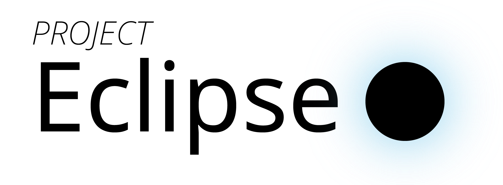

# Project Eclipse 2019 2학기 중간고사 TeX 저장소

    

## Directory Structure
- [`template`](https://github.com/project-eclipse/2019-semester2-midterm/tree/master/template): TeX 파일 템플릿
- [`math-handout`](https://github.com/project-eclipse/2019-semester2-midterm/tree/master/math-handout): 수학 프린트의 뇌피셜 풀이
- *More coming soon!*
